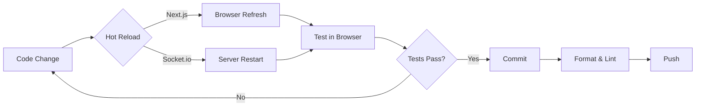

# ScribeAI Architecture Overview

## System Architecture Diagram

```mermaid
graph TB
    subgraph "Client Browser"
        A[Next.js App<br/>Port 3000]
        B[MediaRecorder API]
        C[Socket.io Client]
    end
    
    subgraph "Backend Services"
        D[Socket.io Server<br/>Port 4001]
        E[Express HTTP Server]
        F[Audio Processor]
    end
    
    subgraph "External Services"
        G[Google Gemini API<br/>Transcription]
    end
    
    subgraph "Data Layer"
        H[(PostgreSQL<br/>Port 5432)]
    end
    
    A -->|WebSocket| C
    C -->|Real-time Events| D
    B -->|Audio Chunks| C
    D --> E
    D -->|Process Audio| F
    F -->|Transcribe| G
    G -->|Text Results| F
    D -->|Save Sessions| H
    A -->|Read Sessions| H
    
    style A fill:#61dafb
    style D fill:#010101
    style G fill:#4285f4
    style H fill:#336791
```



## Data Flow

### 1. Session Start
```
User clicks "Start Recording"
    ↓
Next.js triggers MediaRecorder
    ↓
Socket.io emits "session:start"
    ↓
Server creates session in DB
    ↓
Server emits "session:status: recording"
```

### 2. Audio Streaming
```
MediaRecorder captures audio (30s chunks)
    ↓
Client emits "audio:chunk" via Socket.io
    ↓
Server receives chunk
    ↓
Server forwards to Gemini API
    ↓
Gemini returns transcription
    ↓
Server saves to DB & broadcasts to client
```

### 3. Session Stop
```
User clicks "Stop"
    ↓
Client emits "session:stop"
    ↓
Server emits "session:status: processing"
    ↓
Server aggregates full transcript
    ↓
Server calls Gemini for summary
    ↓
Server saves summary to DB
    ↓
Server emits "session:status: completed"
```

## Technology Stack

| Layer | Technology | Purpose |
|-------|-----------|---------|
| **Frontend** | Next.js 14 | React framework with App Router |
| | TypeScript | Type safety |
| | Tailwind CSS | Styling |
| | next-themes | Dark mode |
| **Backend** | Node.js | JavaScript runtime |
| | Express | HTTP server |
| | Socket.io | Real-time WebSocket |
| **Database** | PostgreSQL | Relational database |
| | Prisma ORM | Database ORM (planned) |
| **AI/ML** | Google Gemini | Transcription & summarization |
| **Auth** | Better Auth | Authentication (planned) |
| **DevOps** | Docker | Containerization |
| | Docker Compose | Multi-container orchestration |

## Key Design Decisions

### 1. Monorepo Structure
- **Why**: Shared TypeScript types, easier dependency management
- **Trade-off**: More complex build process vs. code reusability

### 2. Socket.io for Real-time Communication
- **Why**: Bidirectional, event-based, handles reconnection
- **Alternative**: WebRTC (more complex, peer-to-peer)
- **Trade-off**: Server load vs. simplicity

### 3. Chunked Audio Streaming (30s intervals)
- **Why**: Avoid memory overflow, enable real-time transcription
- **Trade-off**: Network overhead vs. memory efficiency
- **Scalability**: Tested for 1+ hour sessions

### 4. PostgreSQL with Prisma
- **Why**: Relational data, complex queries, type safety
- **Alternative**: MongoDB (more flexible schema)
- **Trade-off**: Schema rigidity vs. data integrity

### 5. Next.js App Router
- **Why**: Server components, better performance, modern approach
- **Trade-off**: Learning curve vs. future-proofing

## Scalability Considerations

### For Long-duration Sessions (1+ hours)

**Challenge**: Memory and network efficiency

**Solution**:
1. **Chunked Streaming**: 30-second audio chunks prevent memory buildup
2. **Server-side Buffering**: Temporary storage before DB persistence
3. **Incremental Transcription**: Process chunks immediately, not at end
4. **Connection Resilience**: Auto-reconnect on network drops
5. **State Management**: React state machines (XState planned) for complex flows

**Architecture Comparison**:

| Approach | Latency | Reliability | Memory | Complexity |
|----------|---------|-------------|--------|------------|
| **Chunked Streaming** (chosen) | Low (real-time) | High (retry logic) | Low (30s buffer) | Medium |
| **Upload on Stop** | High (post-processing) | Medium (single failure point) | High (full recording) | Low |
| **WebRTC P2P** | Very Low | Medium (NAT issues) | Low | High |

**Chosen**: Chunked streaming for optimal balance of real-time feedback and reliability.

### For Concurrent Sessions

**Current**: Single-server, vertical scaling
**Future**: 
- Load balancer + multiple Socket.io servers
- Redis for session state sharing
- Horizontal scaling with sticky sessions

## Security Considerations

1. **Environment Variables**: API keys in `.env`, never committed
2. **CORS**: Restricted to `NEXT_PUBLIC_APP_URL`
3. **Input Validation**: Socket.io event payload validation (planned)
4. **Authentication**: Better Auth integration (planned)
5. **Database**: Prepared statements via Prisma (prevents SQL injection)

## File Organization

```
ScribeAI/
├── apps/
│   ├── web/                 # Next.js frontend
│   │   ├── app/
│   │   │   ├── components/  # React components
│   │   │   ├── providers/   # Context providers
│   │   │   ├── lib/         # Utilities (planned)
│   │   │   └── api/         # API routes (planned)
│   │   └── public/          # Static assets (planned)
│   └── api-socket/          # Socket.io backend
│       └── src/
│           ├── index.ts     # Server entry
│           ├── socket.ts    # Event handlers
│           └── lib/         # Utilities (planned)
├── prisma/                  # Database schema (planned)
├── docs/                    # Additional docs (planned)
└── package.json             # Monorepo root
```

## Development Workflow



## Next Steps

- [ ] Prisma schema and migrations
- [ ] Better Auth setup
- [ ] Audio capture UI components
- [ ] Gemini API integration
- [ ] Session history dashboard
- [ ] Export functionality
- [ ] Unit tests (Jest)
- [ ] E2E tests (Playwright)
- [ ] CI/CD pipeline (GitHub Actions)

---

Last updated: PR #1 - Project Bootstrap
